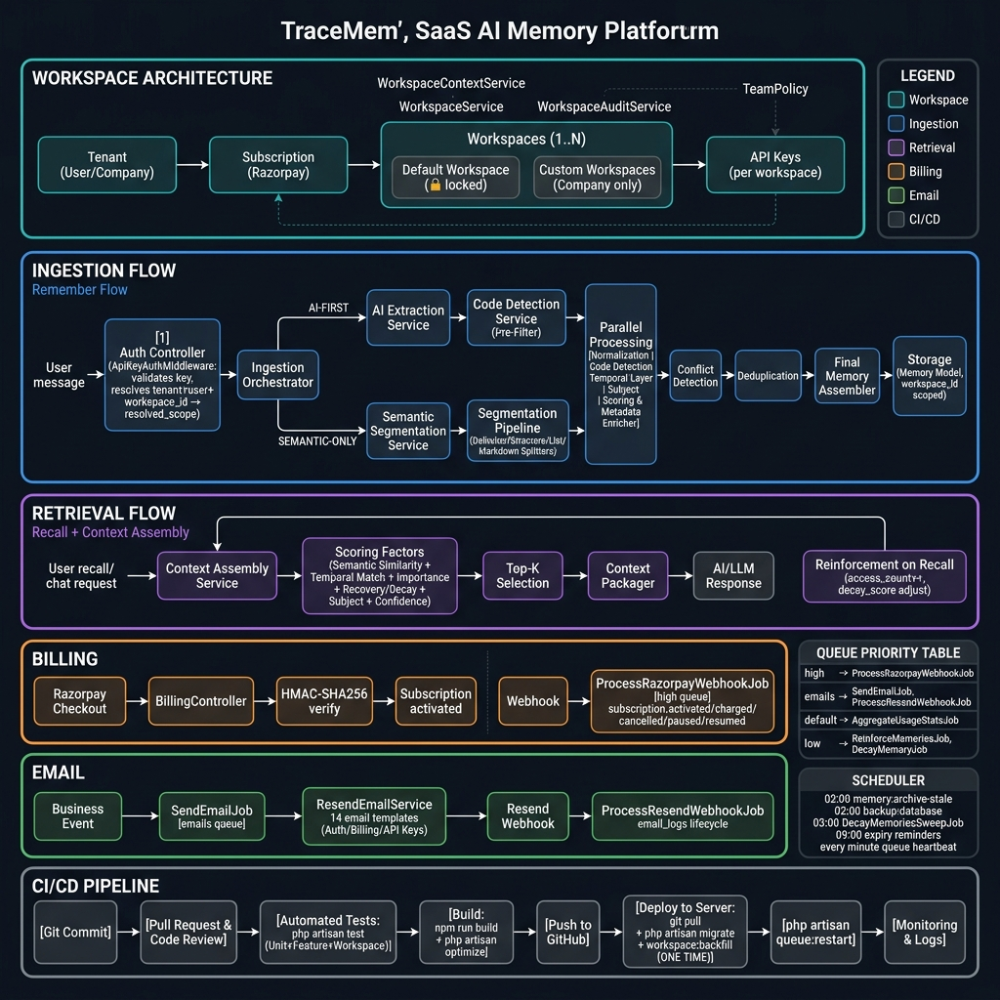
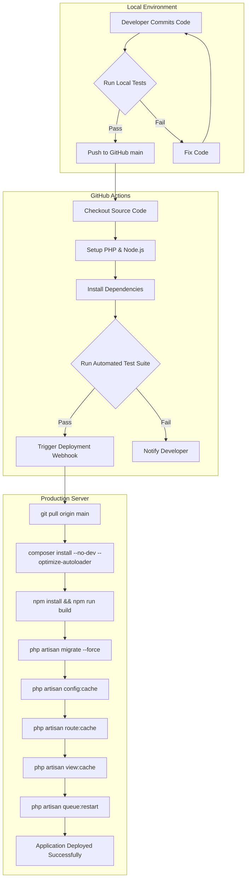

# TraceMem

> A drop-in semantic memory layer for AI applications and Large Language Models — with multi-workspace support, strict tenant isolation, and production-grade billing.

TraceMem provides long-term, persistent context to AI agents by extracting, storing, and seamlessly recalling structured knowledge across user sessions. Instead of relying on fragile keyword matching or manually passing raw chat transcripts into an LLM context window, TraceMem acts as an intelligent intermediary that organises memory by workspace, user, and tenant — cryptographically isolated.

---

## Architecture Overview



The diagram above shows the complete system across six layers:
1. **Workspace Architecture** — multi-tenant, workspace-scoped isolation with Members & Invitations
2. **Ingestion (Remember Flow)** — AI-First and Semantic-Only pipelines
3. **Retrieval (Recall + Context Assembly)** — scored, ranked, reinforced recall
4. **Billing** — Razorpay subscription engine
5. **Transactional Email** — Resend with full delivery lifecycle
6. **CI/CD Pipeline** — automated test → build → deploy lifecycle

---

## Why TraceMem?

| Challenge | TraceMem Solution |
|-----------|------------------|
| Context window limits | Compact, ranked memory blocks — only the top-K relevant memories |
| Irrelevant retrieval | Multi-factor scoring: semantic + temporal + importance + decay + subject |
| Token waste | Context Assembler produces a single prompt-ready string |
| Tenant data leakage | Cryptographic `tenant_scope_id` — every query is scoped |
| Workspace collision | `workspace_id` on every API key and memory — never cross-scoped |
| Stale preferences | Automatic conflict detection and deduplication |

---

## Tech Stack

| Layer | Technology |
|-------|-----------|
| **Backend** | Laravel 13, PHP 8.3+ |
| **Frontend** | React 18, Inertia.js, TypeScript |
| **Auth** | Laravel Fortify (email verification, password reset, 2FA-ready) |
| **Database** | PostgreSQL (production) · SQLite (local/tests) |
| **Billing** | Razorpay — INR, recurring subscriptions, HMAC-SHA256 webhook verification |
| **Email** | Resend via `resend/resend-laravel` — Svix-signed webhook callbacks |
| **Queue & Cache** | Redis — four-priority queue (`high`, `emails`, `default`, `low`) |
| **Scheduling** | Laravel Scheduler — daily backups, memory decay, expiry reminders |
| **Styling** | Vanilla CSS — premium dark aesthetic |

---

## Workspace Architecture

> **Added in v2.0** — the core multi-tenant organisational layer.

### Hierarchy

```
Tenant (User or Company account)
    └── Subscription (Razorpay — Tenant-level, not Workspace-level)
            └── Workspaces (1 for Individual · 1..N for Company)
                    ├── Members (Roles: Owner, Admin, Developer, Member, Viewer)
                    ├── Invitations (Secure email links for joining)
                    ├── API Keys (scoped per workspace)
                    └── Memories (scoped per workspace)
```

### Rules (non-negotiable)

| Rule | Detail |
|------|--------|
| **Billing is Tenant-level** | A subscription belongs to the Tenant, never to a Workspace |
| **Default workspace is locked** | Cannot be deleted, archived, renamed to empty, or transferred |
| **Auto test key only** | On workspace creation, exactly **one test key** is auto-created. No live key |
| **Live keys are manual** | Owner explicitly generates a live key after buying a plan |
| **Slug is immutable** | `teams.slug` is generated once and never changes |
| **Owner from membership** | Owner is derived from `team_members.role = 'owner'` — no `owner_user_id` column |
| **workspace_id is immutable** | Once set on an API key or Memory, it cannot be changed |
| **Individual accounts** | Always exactly one workspace — the default. No workspace management UI |
| **Company accounts** | Multiple workspaces. Full management UI at `/workspaces` |

### Database Schema (Phase A migrations)

```sql
-- teams table extensions
ALTER TABLE teams ADD COLUMN slug          VARCHAR UNIQUE NOT NULL;
ALTER TABLE teams ADD COLUMN status        VARCHAR DEFAULT 'active'; -- active | archived | suspended
ALTER TABLE teams ADD COLUMN environment   VARCHAR;                  -- production | staging | development
ALTER TABLE teams ADD COLUMN purpose       TEXT;
ALTER TABLE teams ADD COLUMN settings      JSONB;
ALTER TABLE teams ADD COLUMN features      JSONB;
ALTER TABLE teams ADD COLUMN limits        JSONB;

-- api_keys: workspace scoping
ALTER TABLE api_keys ADD COLUMN workspace_id BIGINT REFERENCES teams(id);

-- memories: workspace scoping
ALTER TABLE memories ADD COLUMN workspace_id BIGINT REFERENCES teams(id);

-- audit trail
CREATE TABLE workspace_audit_logs (
    id             BIGSERIAL PRIMARY KEY,
    workspace_id   BIGINT NOT NULL REFERENCES teams(id),
    actor_user_id  BIGINT NOT NULL REFERENCES users(id),
    action         VARCHAR NOT NULL,
    subject_type   VARCHAR,
    subject_id     BIGINT,
    metadata       JSONB,
    ip_address     VARCHAR,
    created_at     TIMESTAMPTZ DEFAULT NOW()
);
```

### Key Services

| Service | Responsibility |
|---------|---------------|
| `WorkspaceContextService` | Singleton source of truth for resolving the current workspace |
| `WorkspaceService` | Create / rename / archive workspaces; manage members; auto-create test key |
| `WorkspaceAuditService` | Immutable audit trail for all workspace events |
| `ApiKeyAuthMiddleware` | Validates API key, resolves `tenant_id`, `user_id`, `workspace_id`, `environment` into `resolved_scope` |
| `TeamPolicy` | Authorises workspace actions. Individual users → 403 for all workspace management |

### Production Deployment (one-time)

```bash
# After deploying Phase A migrations to production:
php artisan migrate
php artisan workspace:backfill   # run ONCE only — backfills existing data
```

> **Do not schedule `workspace:backfill`.** It is a one-time data migration. New records created after deployment automatically have `workspace_id` set at creation time.

---

## Getting Started

### Prerequisites

- PHP 8.3+
- Composer
- Node.js v18+ and npm
- PostgreSQL (production) or SQLite (local dev)
- Redis (production — queue + cache; optional locally)

### Installation

```bash
# 1. Clone
git clone https://github.com/Tuhin402/Trace.Mem.git
cd Trace.Mem

# 2. Automated setup
composer run setup

# Or manually:
composer install
cp .env.example .env
php artisan key:generate
php artisan migrate
npm install
npm run build
```

### Environment Variables

```env
DB_CONNECTION=sqlite
DB_DATABASE=/absolute/path/to/database.sqlite

QUEUE_CONNECTION=redis
CACHE_STORE=redis

MAIL_MAILER=log

RAZORPAY_KEY_ID=rzp_test_...
RAZORPAY_KEY_SECRET=...
RAZORPAY_WEBHOOK_SECRET=...

OPENAI_API_KEY=sk-proj-...

RESEND_API_KEY=re_...
RESEND_WEBHOOK_SECRET=whsec_...
```

### Start Development Servers

```bash
composer run dev
# Boots: Laravel server + queue worker + scheduler + Vite HMR
```

---

## API Reference

**Base URL:** `https://api.tracemem.one/v1`

```http
X-API-Key: cmtest_your_key_here
```

### Identity & Memory Isolation Guarantees

Every memory operation in TraceMem relies on three layers of isolation:

1. **`tenant_scope_id` (Internal):** Resolved automatically via the authenticated API Key. Represents your Razorpay billing account.
2. **`workspace_id` (Internal):** Resolved automatically via the authenticated API Key. Represents the strict data boundary (e.g., a specific hospital branch or CRM customer).
3. **`user_id` (Client-Supplied):** **Required** on all memory endpoints. This is a stable identifier representing your downstream end-user (e.g., `customer_8472`, `patient_991`, `session_abcd1234`).

> **Warning:** You must supply a stable `user_id` in your JSON payloads. Changing the `user_id` creates a completely separate memory graph. TraceMem never merges identities.

### Endpoints

| Method | Endpoint | Description |
|--------|----------|-------------|
| `GET` | `/health` | API + Redis queue heartbeat status |
| `POST` | `/remember` | Ingest a message — extract, process, store memories |
| `POST` | `/recall` | Retrieve semantically relevant raw memories |
| `POST` | `/context/assemble` | Fetch a prompt-ready memory context block |
| `POST` | `/chat` | Chat with memory-augmented context (AI-First mode) |
| `POST` | `/debug/memory-decision` | Inspect memory extraction decision (debug mode) |

#### `POST /remember`

Stores semantic facts mapped to the tuple `(tenant_scope_id, workspace_id, user_id)`.

```json
{
  "user_id": "customer_8472",
  "content": "I have a meeting with Q2 investors on Monday at 3pm.",
  "category": "schedule"
}
```

#### `POST /recall`

Retrieves raw memories strictly isolated to the specified `user_id` within the API Key's workspace.

```json
{
  "user_id": "customer_8472",
  "query": "What are my meetings next week?",
  "limit": 10
}
```

---

## API Key Environments

| Key Type | Prefix | Behaviour |
|----------|--------|-----------|
| **Test** | `cmtest_` | Sandbox only. Accepted from localhost / Postman. Auto-created on workspace creation |
| **Live** | `cmlive_` | Production. Requires HTTPS + active paid subscription. Created manually by owner |

API keys are stored **hashed** (SHA-256). Plaintext is shown **once** at creation. Key rotation immediately revokes the previous key.

---

## Ingestion Pipeline (Remember Flow)

```
User Message
    │
    ▼
[1] ApiKeyAuthMiddleware
    Validates key → resolves tenant_id, user_id, workspace_id, environment
    Sets request attribute: resolved_scope
    │
    ▼
[2] Ingestion Orchestrator
    ┌─────────────────┬──────────────────────────────┐
    │  AI-FIRST        │  SEMANTIC-ONLY               │
    │  AI Extraction   │  Semantic Segmentation       │
    │  Service         │  Service + Segmentation      │
    │  Code Detection  │  Pipeline (Delimiter /       │
    │  (pre-filter)    │  Structure / List / MD)      │
    └─────────────────┴──────────────────────────────┘
    │
    ▼
[4] Parallel Processing
    ├── Normalization Service
    ├── Code Detection Service
    ├── Temporal Layer
    ├── Subject Detection Service
    └── Scoring & Metadata Enricher
    │
    ▼
[5] Conflict Detection → [6] Deduplication → [7] Final Memory Assembler
    │
    ▼
[8] Storage (Memory Model)
    workspace_id scoped · tenant_scope_id isolated
```

---

## Retrieval Pipeline (Recall + Context Assembly)

```
User Query (/recall or /chat)
    │
    ▼
Context Assembly Service
    Segments query → extracts temporal intent → candidate memories
    │
    ▼
Multi-Factor Scoring (per candidate)
    Semantic Similarity + Temporal Match + Importance
    + Decay Score + Subject Relevance + Confidence
    │
    ▼
Top-K Selection → deduplicate → apply token budget
    │
    ▼
Context Packager → prompt-ready block
    │
    ▼
Reinforcement on Recall
    access_count++ · last_accessed_at updated · decay_score adjusted
```

---

## Billing — Razorpay Integration

Billing is **Tenant-level** — subscriptions belong to the account, not to a workspace.

### Checkout Flow

1. User selects plan → `POST /billing/checkout`
2. Backend creates Razorpay Plan + Subscription
3. Pending `BillingTransaction` recorded
4. Frontend initialises Razorpay JS modal
5. On success → `POST /billing/verify-payment`
6. Server verifies `HMAC-SHA256(payment_id|subscription_id, key_secret)`
7. Subscription activated atomically

### Webhook Flow

```
POST /razorpay/webhook
    HMAC-SHA256 verified → 200 immediately
    ▼
ProcessRazorpayWebhookJob [high queue]
    UNIQUE constraint on event_id (idempotency)
```

**Supported events:** `subscription.activated` · `subscription.charged` · `subscription.completed` · `subscription.cancelled` · `subscription.paused` · `subscription.resumed` · `payment.captured` · `payment.failed` · `refund.processed` · `order.paid`

---

## Transactional Email — Resend Integration

```
Business event → SendEmailJob [emails queue]
    → ResendEmailService
        → EmailLog (queued → sent → delivered → bounced)
        → Resend API
```

| Category | Templates |
|----------|-----------|
| **Auth** | Verification, Password Reset, Password Changed, Email Changed |
| **Billing** | Purchased, Renewed, Cancelled, Payment Received, Payment Failed, Refund, Expiry Reminder |
| **API Keys** | Created, Rotated, Expiry Reminder |

Every email carries `X-TraceMem-Request-Id`, `X-TraceMem-Log-Id`, `X-TraceMem-Template` headers.

---

## Security

### HTTP Security Headers

| Header | Value |
|--------|-------|
| `Content-Security-Policy` | Whitelists Razorpay JS/iframe; `unsafe-inline` for Inertia |
| `Strict-Transport-Security` | `max-age=31536000; includeSubDomains` |
| `X-Frame-Options` | `SAMEORIGIN` |
| `X-Content-Type-Options` | `nosniff` |
| `Referrer-Policy` | `strict-origin-when-cross-origin` |
| `Permissions-Policy` | camera, mic, geolocation, payment, USB — all disabled |
| `Cross-Origin-Embedder-Policy` | `unsafe-none` (preserves Razorpay iframe) |

### Webhook Security

- **Razorpay:** `HMAC-SHA256(rawBody, secret)` → `X-Razorpay-Signature`
- **Resend (Svix):** `HMAC-SHA256(svix-id.svix-timestamp.rawBody, secret)` → `svix-signature`

Both use `hash_equals()` (timing-safe). Both return `400` on invalid signatures.

### Auth & Passwords

- Minimum 12 characters, mixed case, digits, symbols
- `BCRYPT_ROUNDS=12` in production
- `Password::uncompromised()` — blocks breach-database passwords
- `DB::prohibitDestructiveCommands()` — prevents accidental DROP/TRUNCATE

---

## Testing

### Structure

```
tests/Feature/Workspace/
├── WorkspaceContextServiceTest.php   (12 cases)
├── WorkspaceServiceTest.php          (11 cases)
├── WorkspaceControllerTest.php       (13 cases)
├── WorkspaceApiKeyTest.php           (6 cases)
└── WorkspaceMemoryTest.php           (5 cases)
```

### Coverage

| File | What it tests |
|------|--------------|
| `WorkspaceContextServiceTest` | `current()` · stale ID fallback · `NoWorkspaceException` · archived fallback · `switchTo()` · `isIndividual()` · `isOwner()` |
| `WorkspaceServiceTest` | Workspace creation · auto test-key · no live key · audit log · rename · archive locked guard · last-owner guard |
| `WorkspaceControllerTest` | Guest auth · 403 for Individual · Company CRUD · Policy enforcement |
| `WorkspaceApiKeyTest` | workspace binding · immutability · dashboard POST endpoint · guest guard |
| `WorkspaceMemoryTest` | `store()` scoping · `recall()` filtering · backward compat · immutability |

### Run

```bash
php artisan test tests/Feature/Workspace   # workspace only
php artisan test                           # full suite
```

> Workspace tests use `Queue::fake()` and mock `SubscriptionEntitlementService` to avoid Redis dependency locally. Production always uses real Redis.

---

## Production Operations

### Queue Worker (Supervisor)

```ini
[program:tracemem-worker]
command=php /var/www/tracemem/artisan queue:work redis --queue=high,emails,default,low --sleep=3 --tries=3 --max-time=3600
autostart=true
autorestart=true
numprocs=2
```

| Queue | Jobs | Retries |
|-------|------|---------|
| `high` | `ProcessRazorpayWebhookJob` | 5 tries · exponential backoff |
| `emails` | `SendEmailJob` · `ProcessResendWebhookJob` | 3–5 tries |
| `default` | `AggregateUsageStatsJob` | Laravel defaults |
| `low` | `ReinforceMemoriesJob` · `DecayMemoryJob` · `DecayMemoriesSweepJob` | Laravel defaults |

### Scheduled Tasks

```bash
* * * * * cd /var/www/tracemem && php artisan schedule:run >> /dev/null 2>&1
```

| Time | Task | Purpose |
|------|------|---------|
| 02:00 daily | `memory:archive-stale` | Archives low-confidence memories |
| 02:00 daily | `backup:database` | Compressed DB backup + auto-pruning |
| 03:00 daily | `DecayMemoriesSweepJob` | Memory decay scoring |
| 09:00 daily | `email:api-key-expiry-reminders` | 7-day advance API key expiry emails |
| 09:00 daily | `email:plan-expiry-reminders` | 7-day advance plan expiry emails |
| Every minute | Queue heartbeat | Redis key TTL 120s → `/api/v1/health` |

### Failed Jobs

```bash
php artisan queue:failed
php artisan queue:retry {id}
php artisan queue:retry all
php artisan queue:prune-failed --hours=168
```

---

## CI/CD Deployment

We employ a robust, automated CI/CD pipeline to ensure that Trace.Mem remains stable in production.



> `workspace:backfill` is a **one-time** command. Never schedule it. All new records get `workspace_id` set automatically at creation time.


---

## Project Structure (Key Files)

```
app/
├── Console/Commands/WorkspaceBackfillCommand.php
├── Enums/TeamRole.php                    (Owner | Admin | Developer | Viewer | Member)
├── Exceptions/NoWorkspaceException.php
├── Http/
│   ├── Controllers/
│   │   ├── WorkspaceController.php
│   │   ├── ApiKeyController.php
│   │   └── BillingController.php
│   ├── Middleware/
│   │   ├── ApiKeyAuthMiddleware.php      (resolves resolved_scope)
│   │   └── SecurityHeaders.php
│   └── Requests/WorkspaceRequest.php
├── Models/
│   ├── Team.php                          (slug, status, isLocked())
│   ├── User.php                          (account_type, tenant_scope_id)
│   ├── ApiKey.php                        (workspace_id immutable)
│   └── Memory.php                        (workspace_id immutable)
├── Policies/TeamPolicy.php
└── Services/
    ├── Workspace/
    │   ├── WorkspaceContextService.php
    │   ├── WorkspaceService.php
    │   └── WorkspaceAuditService.php
    ├── Auth/
    │   ├── ApiKeyService.php
    │   └── SubscriptionEntitlementService.php
    └── Memory/MemoryService.php

database/migrations/
    2026_07_21_000001_extend_teams_for_workspaces.php
    2026_07_21_000002_add_workspace_id_to_api_keys.php
    2026_07_21_000003_add_workspace_id_to_memories.php
    2026_07_21_000004_create_workspace_audit_logs.php
    2026_07_21_000005_add_workspace_limits_to_teams.php

resources/js/
├── components/
│   ├── workspace-switcher.tsx
│   └── workspace-status-banner.tsx
└── pages/app/Workspaces.tsx
```

---

## License

This project is proprietary software. All rights reserved.