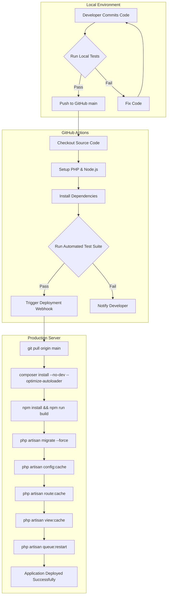

# CI/CD Pipeline

We employ a robust, automated CI/CD pipeline to ensure that TraceMem remains stable in production.

## Deployment Architecture

## Testing Suite

The CI pipeline automatically runs our comprehensive test suite, executing all Feature and Unit tests before allowing a deployment. For instance, the Workspace isolation tests ensure that:
- Individual accounts get 403s on workspace endpoints.
- API keys are permanently locked to their workspace.
- The `WorkspaceContextService` correctly prevents cross-tenant data leaks.
